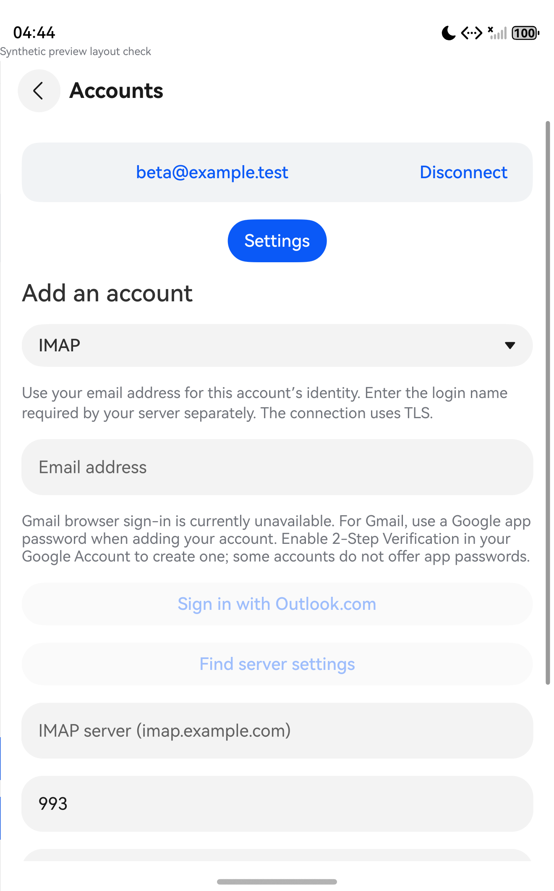

# D-Mail source preparation — 14 September 2026

The first source commit presents this project as an independent AI-assisted
port/rework developed with OpenAI Codex, under MPL-2.0. Upstream attribution,
license notices and source provenance remain intact.

Visible app names, descriptions, sample welcome text and browser return text now
use D-Mail. The legacy bundle ID, database/Asset identities and native ABI are
unchanged. This is a source/publication preparation, not an installed release;
version 0.1.11 remains the installed baseline on both physical devices.

Default packages hide Google browser sign-in and Google reconnect. English and
Simplified Chinese setup text asks users to use a Google app password. The
explicit `RegisteredMailOAuth.googleBrowserSignInEnabled` build constant retains
the experimental opt-in. Existing saved OAuth account validation, token refresh
and Microsoft sign-in are preserved; no accounts are migrated or removed.

The README, contribution guidance and GitHub publishing instructions now describe
the current scope and limitations. GitHub Actions runs synthetic host tests.
Ignored credentials, signing, downloads and build output stay local. Published
historical validation records redact physical serials and a local Wi-Fi address;
their artifact hashes and test outcomes are preserved. Git attributes retain
upstream patch context and imported license/vendor whitespace verbatim.

## Validation

- All 291 host tests passed, including default Google sign-in/reconnect refusal,
  preserved Google token validation and Microsoft reconnect. The same suite
  passed from a clean source snapshot with only the test compiler provided.
- The unsigned x86 production HAP and both isolated native-test HAPs built with
  CLI/SDK 26. Existing compiler API-compatibility warnings remain. Imported Swift
  core bytes are unchanged; no native protocol rebuild was needed.
- The bounded native UI gate passed in 23.537 seconds. It verified hidden Google
  sign-in/reconnect, visible app-password guidance, Microsoft sign-in and the
  password field, and preservation of the synthetic saved account and cached
  bodies. Exactly two in-memory body reads occurred; no provider/browser access.
- The wrapper removed the isolated app and stopped the emulator; native-process
  absence was checked separately. Production was never launched and no physical
  device received this build.

Artifact hashes and structured results are in
[the validation record](../port/mail-corpus/d-mail-preparation-validation.json).
The configured GitHub workflow has been prepared but has not yet run on GitHub.
See [publication instructions](publishing.md) for creating an empty D-Mail remote
and pushing the reviewed local commit.
